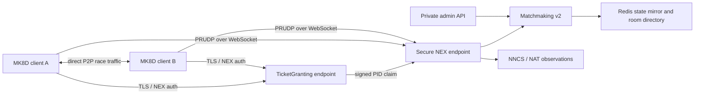
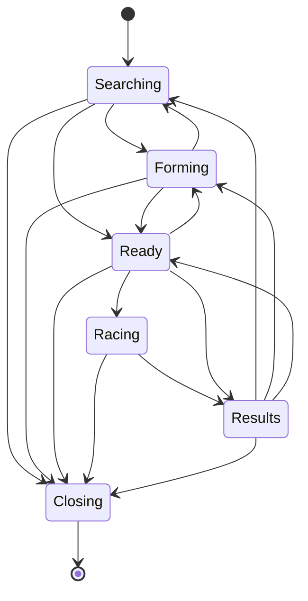

# Architecture

## Design goal

Improve matchmaking and session recovery without putting latency-sensitive race state through the
game server. The control plane may use Redis and policy logic; the data plane remains P2P.



## Components

### Auth endpoint

- Decodes LoginEx extra data.
- Extracts the BAAS JWT `nnex` claim without trusting the outer JWT.
- Validates the embedded `nx2` HMAC, expiry and PID binding.
- Applies account availability gates.
- Records a short-lived PID claim for a subsequent ticketless secure CONNECT.

When clients share a public IP, claims are consumed FIFO rather than using “last login wins”. This
is a compatibility bridge, not a substitute for a cryptographically bound secure ticket.

### Secure endpoint

Provides SecureConnection, matchmaking, NAT traversal, ranking and utility protocols. It owns live
connections and exposes read-only snapshots to monitoring.

### Matchmaking engine

Each room contains wire-compatible `MatchmakeSession` state plus server-only metadata:

- lifecycle phase and monotonically increasing epoch;
- creation and last-activity timestamps;
- atomic seat reservations;
- participant and reconnecting PID sets;
- host connection ID;
- private-room code mapping.

Server-only fields never change the serialized NEX structures returned to existing clients.

### Quality registry

Scores only observed facts:

- fresh station registration;
- a usable public address, port and RVCID;
- ReplaceURL observation;
- presence of NAT mapping/filtering fields.

It does not guess client FPS, bandwidth or undocumented NAT enum meanings.

### Redis

Redis is an expiring state mirror and coordination foundation:

```text
nextendo:mk8d:service:<instance>       service heartbeat
nextendo:mk8d:rooms:<instance>         complete local snapshot
nextendo:mk8d:room:<instance>-<gid>    individual room lease
nextendo:mk8d:room-index               global sorted index by update time
nextendo:mk8d:presence:<instance>:<pid> expiring player presence
nextendo:mk8d:events                    bounded connection-event stream
```

An unavailable Redis does not interrupt an active race or in-memory matchmaking unless
`REDIS_REQUIRED=1` is explicitly chosen for startup readiness.

## Session lifecycle



Invalid jumps are rejected in server metadata. The client still receives the same expected NEX
responses to preserve compatibility.

## Match selection

Candidate selection follows this order:

1. Reuse the requester's existing compatible, non-closing room.
2. Exclude closed, full, stale, racing or host-recovering rooms.
3. Apply game-mode and configurable attribute-prefix compatibility.
4. Gradually reduce the attribute-prefix requirement as the room waits.
5. Score occupancy, age and observed host quality.
6. Reserve capacity atomically, then commit the participant.
7. Create a new room only when no candidate succeeds.

## Retry handling

Mutating RMC calls are keyed by connection ID, protocol, method, call ID and body hash. A duplicate
within the configured window receives a cloned cached response. Asynchronous reads such as
GetSessionURLs are deliberately excluded.

## Reconnection

A transport loss creates a PID lease. Reentry with the same authenticated PID:

- cancels eviction;
- refreshes activity;
- replaces a stale host connection ID when applicable;
- replays participation state to rebuild the control-plane view.

Explicit EndParticipation is final and bypasses the reconnect lease.

## Multi-instance boundary

The Redis room index answers “which instance reports this room?” but a join is still handled by the
instance that owns the in-memory gathering. A production multi-instance rollout additionally needs
an ingress/router or explicit handoff protocol. This repository does not claim that Redis alone
makes joins horizontally scalable.
