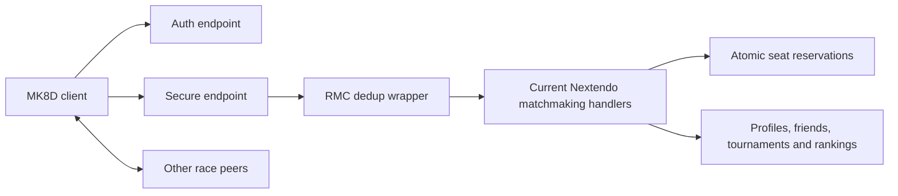

# Architecture

## Design goal

Preserve the current Nextendo server and NEX behavior while adding two control-plane reliability
primitives. Race data remains peer-to-peer; this branch does not proxy gameplay traffic.



## RMC deduplication

Deduplication wraps only the three matchmaking protocol handlers registered by the MK8D server.
The cache key is:

```text
(connection ID, PID, protocol, method, call ID, SHA-256(body))
```

An unseen key installs an in-flight entry before calling the underlying handler. Concurrent copies
wait on that entry. A non-nil response is cloned into the completed entry and reused until expiry;
a nil response removes the entry. The cache periodically prunes expired entries and is bounded by
`MATCHMAKING_DEDUP_MAX_ENTRIES`.

The body hash prevents an incorrectly reused call ID from collapsing two different operations. PID
and connection ID prevent retries from different players or sessions from sharing a response.

## Seat reservations

Each gathering retains an internal map from PID to expiration time. Under the existing matchmaking
mutex:

1. expired reservations are removed;
2. capacity is calculated as `participants + reservations`;
3. a seat is reserved only if the effective capacity is below `MaxParticipants`;
4. commit verifies that the reservation is still live;
5. the reservation is deleted and the PID is appended exactly once.

Reservations are never encoded into `MatchmakeSession.NumParticipants`. They protect capacity but do
not claim that a player has completed participation.

## Compatibility

The integration begins from the current public mirrors. No handler for profiles, friends,
tournaments, tournament rankings, NAT compatibility or notifications is replaced. The server's
workspace `replace` directive only makes local builds use the matching core directory.

## Identity

No FIFO claim queue exists in this branch. The inherited upstream authentication behavior remains
unchanged. A future identity change requires an independent security design and review.
